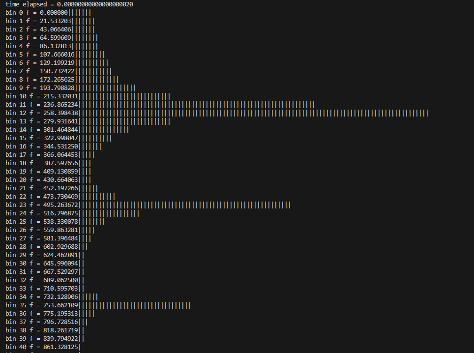

# FFT Simulation - C Code

## Overview
This repository contains the Fast Fourier Transform (FFT) implementation in C code, developed by [Your Name]. The FFT algorithm is applied to parallel real data stored in a single buffer. The repository includes the initialization function, complex element type, and the main FFT algorithm. Additionally, a time variable is provided to measure the time taken for the FFT operation.

## File Structure
- **init_fft**: This method initializes the array W of type `cplx`, which holds cosine/sine values on each index. Each element is computed to the index returned by the product k*n. If the product is greater than N, the cosine/sine value is a sum of L*2*PI (where L is an integer) + phase. The "phase" part should only be evaluated for that index, but it will not result in a new number in comparison with the current ones stored in the array. By using this methodology, the total RAM space needed to store all the elements in array W is reduced. Note that 1 float = 4 Bytes, so 1 cplx item = 8 Bytes.
- **fft**: This method applies the FFT algorithm to a specified buffer and returns a new buffer of type `cplx`. Each element of the returning buffer will now have a real and imaginary value.
    - **scale_factor**: A typical value used to custom-normalize data visualized in printing commands.
    - **t**: A `clock_t` element used to identify the time consumed by our PC to apply FFT and return the results. Note that PCs usually run at 3+ GHz clock, so our MCU board will probably scale the total time up by a factor equal to 3+GHz/16MHz.
    - **inputBuf**: A typical buffer of SAMPLES elements which stores the input data. This buffer was pre-constructed to check if FFT works well (e.g., there is a sum of three different sines). In normal cases, this buffer will be updated on each while loop of the MCU board, and once there are SAMPLE number of elements, FFT will be applied.

## Usage
Feel free to view and use the code as open-source. Contributions and improvements are welcome.

## Simulation Preview

       
